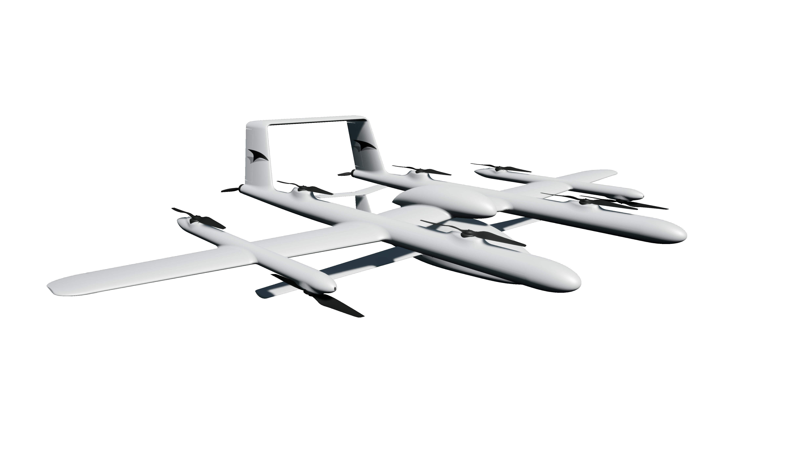
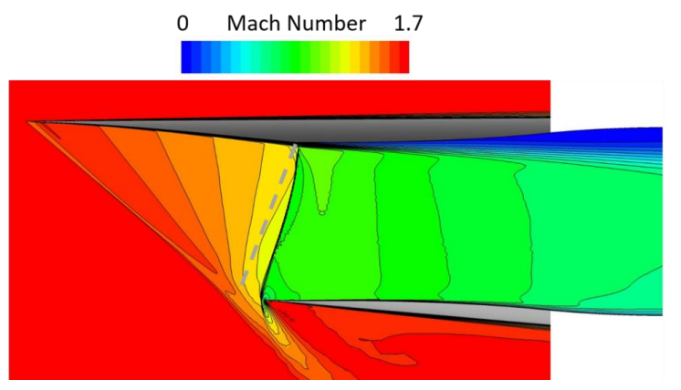
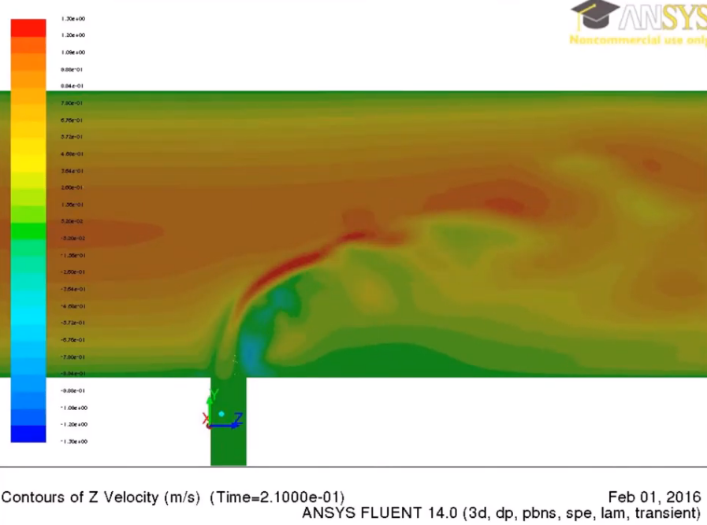

# Mechanical/Aerospace Engineering Summary

I have over 8 years experience in the aerospace industry. My experience is focused on conceptual aircraft design (MDAO), mechanical component design, computational physics analysis (CFD/FEA), and systems engineering. I look forward to helping you bring your engineering vision to life.

## Skills Summary

| Field       | Keywords                                                                             |
| ----------- | ------------------------------------------------------------------------------------ |
| Aerospace   | Aircraft Design (MDAO), CFD, Vehicle Aerodynamcis, Test Engineering                  |
| Mechanical  | CAD (NX), FEA (Femap/NASTRAN), Additive Manufacturing, Various Manufacturing Methods |
| Software    | OpenVSP, Python, Matlab, LabView                                                     |
| Soft Skills | Requirements Tracking, Program Management, Risk Mitigation                           |

## Experience

::: details Aircraft Design Engineer | L3/L4 | Talyn Air | 08/21 - 04/23

<a href="https://www.youtube.com/watch?v=0_fjfnDyqVU&ab_channel=TalynAir">Youtube Spot</a>

- Aircraft design generalist. Conducted trade studies across various disciplines to help size and design an eVTOL aircraft system. Subsystems investigated include propellers, rotors, motors, battery systems, wings, empennage design, and avionics. Utilized <b>OpenVSP</b> and <b>Python</b> to conduct MDAO trade studies.
- Post-processed subscale flight test data to validate aerodynamic predictions and identify system performance. Utilized this data into a 6DOF Simulink model.
- Utilized Vortex-Lattice aerodynamics solvers to predict the performance of both the aircraft and its propellers. Developed aerodynamic databases for use in 6DOF model.
- Configured the vehicle OML with input from various subdisciplines. Kept meticulous record of a change log to track vehicle changes.
- Generated airloads from V-n diagram (per CFR 23) for use in a structural model in order to determine critical load cases. Handed off aerodynamic loads to structures team for FEA.
- Conducted trade studies on various battery architectures to converge upon design which met vehicle energy and power requirements. This includes conceptual full electric and hybrid powertrain studies.
- Applied load cases to nose gear landing gear FEM  to ensure component safety margins were met.
- Carried various flight parts from concept design to flight integration. This includes managing part numbers through out the release workflow, managing component requirements, and conducting loads and structural analysis to size hardware.
- Generated test cards for static thrust propeller testing with expected loads of up to 700lb.
- Captured live test data utilizing NI DAQ with LabView. Data post-processed with Python scripts.

:::

::: details Propulsion Engineer | L2/L3 | Northrop Grumman | 01/18 - 07/21

- Led multi-disciplinary teams in designing and integrating clean sheet sub- to supersonic vehicle inlets and exhaust ducts which positioned team to capture various RFP. Design phases included conceptual, preliminary, and detailed design.
- Conducted parametric engine cycle analysis to determine engine performance across flight envelope. Performed gradient-based engine cycle optimization by setting design variables, objectives, and constraints.
- Generated and conducted parametric CFD studies of relevant geometries for vehicle-inlet integration. Automated linking between softwares to take model from CAD to CFD to post-process.
- Utilized CFD with aerodynamic shape optimization techniques to improve propulsion system performance; this included setting objetive and constraint functions. Wrote accompanying process documents to disseminate knowledge. Made significant progress in making this technique a group standard practice in design cycle.
- Acquired and analyzed data during live testing of vehicle model at NASA wind tunnel. Developed and documented tools to improve inlet analysis and design. Wrote final report and communicated findings to customers in final briefing.
- Implemented and managed schedule-driven technical plans for a variety of preliminary and conceptual design programs. These included considerations of cost, engineer and manufacturing hours, and fiscal cycles. Managed program to meet cost/budget forecasts. Programs ranged in sized from $0.3 to $1.0 million.
  :::

::: details Loads & Dynamics Engineer | L2 | Northrop Grumman | 11/16 - 1/18

- Calculated flight loads on air vehicle utilizing various softwares including FEMAP and ZONAIR. Gained experience running MSC and NX NASTRAN to obtain V-F-G results.
- Created a Matlab tool to simulate aircraft loads during various Navy carrier landing conditions. Work focus was on time-histories of landing gears to determine fatigue load cycles. Ground loads delivered as NASTRAN grid/load BDFs. Studies included taxi, catapult, arresting hook, and crosswind landing cases.
- Work helped standardized ground loads delivery process across work centers. Prepared material and presented tool to senior team members over a 32-hour training.  
  :::

::: details VMS Technician | L2 | Northrop Grumman | 12/17 - 03/18

- Performed routine electrical lab maintenance tasks including terminating various cable types, soldering electrical components, creating breadboard test beds, affixing electrical enclosures.
- Set up a rotating actuator for a HITL test bed. Interfaced the DAQ unit to the actuator via Matlab Simulink.
- Generated Simulink models of electro-mechanical systems.
  :::

::: details Summer Intern / Masters Thesis | Air Force Research Lab | 08/14 - 07/16

- Wrote M.S. thesis which analyzed the mixing behavior within a T-type jet-in-crossflow configuration.
- Performed grid generation through ANSYS and GridPro gridding software.
- Ran simulation utilizing commercial FLUENT package. Utilized HPC systems for job submittal.
- Ran CFD simulation with RANS and pseudo-DNS models. Determined solution sensitivity to grid resolution and y+ metrics.
- Conducted parametric study to analyze pertinent flow parameters and effects on vortical structures.
- Summarized and presented results on a biweekly basis to senior team members.
- Identified primary vortical structures in flow field, determined parameters pertinent to mixing efficiency, and validated results with experiment and literature findings. 
  :::
